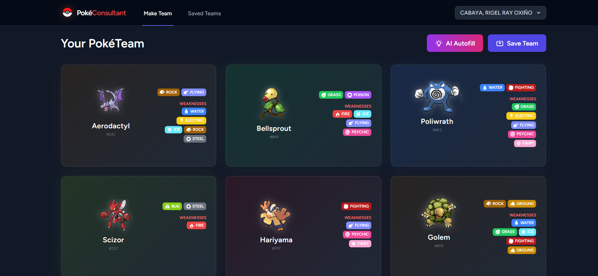
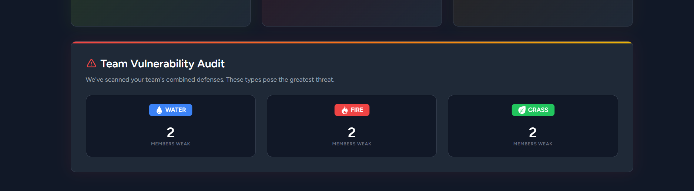
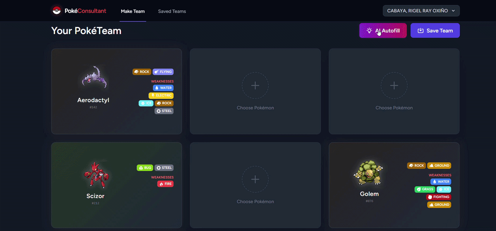
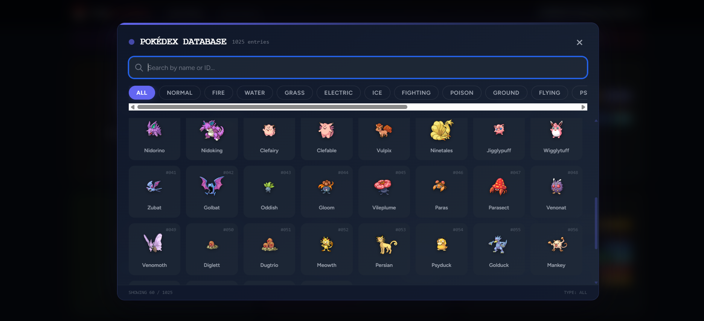

# PokeConsultant

A competitive Pokémon team builder with AI-powered suggestions. Build your team of 6, get a real-time vulnerability audit, and let the AI consultant fill your remaining slots with type-coverage-optimized picks.

---

## Features

### Team Builder



Build a team of up to 6 Pokémon using a full Pokédex browser. Each slot shows the Pokémon's animated sprite, type badges, and its top weaknesses at a glance.

---

### Pokédex Browser

Search across all 1,025 Pokémon by name or Pokédex number. Filter by type, scroll infinitely, and pick your members in seconds.

---

### Team Vulnerability Audit



The audit panel recalculates every time your team changes. It surfaces the top 3 type threats — showing how many of your members are weak to each — so you know exactly what gaps need covering.

---

### AI Autofill



One click fills all remaining empty slots. The AI consultant analyses your current team's defensive coverage, identifies unresisted weaknesses, and suggests complementary Pokémon — each chosen to cover a different gap.

---

### Saved Teams



Save any team with a custom name. Load a saved team back into the builder, or delete ones you no longer need. Teams are tied to your account.

---

## Tech Stack

| Layer | Technology |
|---|---|
| Backend | Laravel 11 |
| Frontend | React 18 + Inertia.js |
| Styling | Tailwind CSS |
| Database | MySQL |
| AI | Gemini 2.0 Flash via AIML API |
| Pokémon Data | PokéAPI |

---

## Getting Started

### Prerequisites

- PHP 8.2+
- Composer
- Node.js 18+
- MySQL

### Installation

```bash
git clone https://github.com/RigelKukoy/PokeConsultant.git
cd PokeConsultant

composer install
npm install

cp .env.example .env
php artisan key:generate
```

Configure your `.env`:

```env
DB_DATABASE=pokeconsultant
DB_USERNAME=root
DB_PASSWORD=

AIML_API=your_aiml_api_key_here
```

```bash
php artisan migrate
npm run build
php artisan serve
```

Visit `http://localhost:8000`.

---

## Environment Variables

| Variable | Description |
|---|---|
| `AIML_API` | API key from [aimlapi.com](https://aimlapi.com) — required for AI Autofill |
| `DB_*` | Standard MySQL connection settings |

---

## License

MIT
